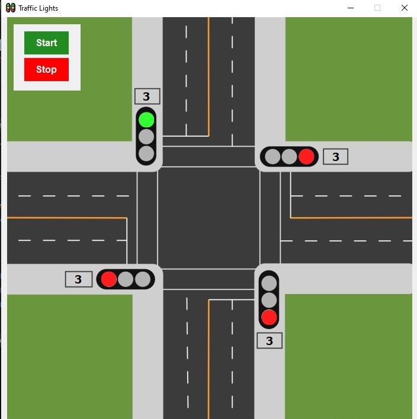

# Traffic Lights System

* A Traffic Lights system built using .NET Forms with C#. 
* This application simulates a traffic light sequence, changing colors based on predefined timing or user interaction. 
* It visually represents real-world traffic light behavior for educational or simulation purposes.

---

---

## Features
1. Simulates standard traffic light sequence (Red → Yellow → Green)
2. Timer-based automatic light transitions
3. Manual control option for testing and learning
4. User-friendly Windows Forms UI

## Installation
1. Clone the repository
2. Open the project in Visual Studio.
3. Build and run the application.

